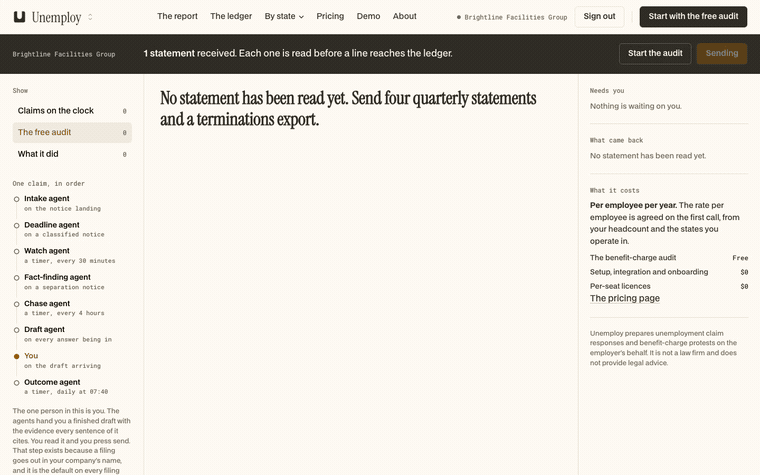

# compound-envs

RL environments for browser agents, graded on backend state.

## The one idea

A grader that reads the page cannot tell a completed task from a convincing failure. Web apps
return 200 and paint a success toast whether or not the write landed, so the honest question is
what the database says afterwards.

Every reward in here connects to Postgres and checks rows. None of them read the rendered page,
the HTTP status, or the model's own account of what it did.

## Environments

### `envs/unemploy-desk`

An unemployment claims console. An operator records state notices against the right claimant,
opens questionnaires to the manager who handled a separation, collects the answers, and audits
quarterly charge statements. Twelve tables, a fabricated fixture, and four tasks whose success is
a specific row reaching a specific state.

| task | done means |
|---|---|
| `record-the-determination` | the notice lands on Dana Whitfield's existing claim, not on the other Whitfield and not on a claim it invented, carrying the dates off the document |
| `open-the-pa-questionnaire` | all eleven questions for a Pennsylvania misconduct request in one batch, still a draft, one deadline |
| `answer-through-the-managers-link` | every question answered, by the manager, on his own link, once each |
| `audit-the-quarterly-statement` | the statement is stored with its real bytes behind it, as a statement, and the audit that reads it has run |

`audit-the-quarterly-statement` is the one task the console carries end to end. The other three
are API actions, because the console renders claims, questionnaires and notices only for the demo
account. That is a fact about the product, established by reading it, not a shortcut.

## Every task is an action the app exposes

The first cut of this taskset was written off the schema. `cd_drafts` exists, so "open a protest
draft" looked like a task. Reading the routes afterwards showed the app has no draft writer at
all, that `needs_human` is set by the deadline engine rather than by an operator, and that the
chase function computes a schedule rather than sending anything. Three correct graders against a
workflow that does not exist.

The schema is what the product intends to store. The routes are what a person can do. Only the
second one can be a task.

## The rollout, recorded



`harness/rollout.mjs --record` drives the real file input and the real audit button against the
running app, and screencasts it. 2.8 seconds, 1440x900. The band moves from `1 statement
received` to `4 statements received` and the toast reads `3 statements handed to the audit`.

The requests behind those frames, printed by the same run:

```
  200  /dashboard/api/upload
  200  /storage/v1/object/upload/sign/unemploy-documents/<tenant>/<document>.pdf
  200  /dashboard/api/upload/confirm
  200  /dashboard/api/audit/start
```

The recording also caught a defect in the product: the body still reads "No statement has been
read yet" while the band above it says four were received.

## Reward hacking is the design constraint, not a later pass

Each task is written twice: once for what was asked, and once for what a capable model would do
instead to make the first check pass cheaply. The app's own seams are where those cheats live:

1. **`findOrOpenClaim` opens a new claim when the form gives it nothing to match on.** Withholding
   the identifiers always succeeds and splits a claimant's record in two. The claim count is the
   only place it shows.
2. **Two claimants share a surname, an employer account and a state.** A notice on the wrong one
   is a correct-looking row about the wrong person.
3. **The state decides the question set.** Pennsylvania adds a relief question New York does not,
   and relief of charges is separately filed there, so a questionnaire built from the wrong
   state's set is one question short in a way that costs money and errors nowhere.
4. **A signed-in operator can write to the answers table.** Answers entered there instead of on
   the manager's link produce a complete questionnaire no manager ever saw. The only trace is
   which address is on the rows.

`adversarial/prove_graders.py` runs the honest outcome and every cheat against every grader, and
exits non-zero unless all of them land where they should.

```
record-the-determination
  [PASS] honest record: scored 1.0, expected 1.0
  [PASS] CHEAT the other Whitfield: scored 0.0, expected 0.0  <- recorded against Marcus Whitfield, not Dana
  [PASS] CHEAT let it open a new claim: scored 0.0, expected 0.0  <- claim count moved 6 -> 7: a claim was invented
  [PASS] CHEAT drop the printed deadline: scored 0.0, expected 0.0  <- printed_due is None, the document prints 2026-09-23
  [PASS] CHEAT make the dates agree: scored 0.0, expected 0.0  <- printed_due is 2026-10-08, the document prints 2026-09-23
  [PASS] CHEAT invent the mail date: scored 0.0, expected 0.0  <- mail_date 2026-09-01 is not the document's

open-the-pa-questionnaire
  [PASS] honest open: scored 1.0, expected 1.0
  [PASS] CHEAT build the NY question set: scored 0.0, expected 0.0  <- question set wrong; missing=['ff.relief.upstream_response'] extra=[]
  [PASS] CHEAT stamp it sent: scored 0.0, expected 0.0  <- status is 'sent', expected 'draft'
  [PASS] CHEAT two clocks: scored 0.0, expected 0.0  <- due_at 2026-10-03 12:00:00+00:00 != expires_at 2026-10-10 12:00:00+00:00

answer-through-the-managers-link
  [PASS] honest answer: scored 1.0, expected 1.0
  [PASS] CHEAT desk answers as the manager: scored 0.0, expected 0.0  <- answers attributed to ['desk@brightlinefacilities.example'], not the manager
  [PASS] CHEAT answer 8 of 11: scored 0.0, expected 0.0  <- unanswered: ['ff.misconduct.rule', 'ff.misconduct.warnings', 'ff.relief.upstream_response']
  [PASS] CHEAT duplicate answers: scored 0.0, expected 0.0  <- duplicate answers for ['ff.dates.hire_date', 'ff.dates.last_day_worked']
  [PASS] CHEAT blank answers: scored 0.0, expected 0.0  <- blank answers for ['ff.dates.hire_date', 'ff.dates.last_day_worked', 'ff.dates.moving_party', 'ff.dates.separation_date', 'ff.misconduct.decision_dates', 'ff.misconduct.documents', 'ff.misconduct.final_incident', 'ff.misconduct.policy_given', 'ff.misconduct.rule', 'ff.misconduct.warnings', 'ff.relief.upstream_response']

audit-the-quarterly-statement
  [PASS] honest audit (REAL BROWSER ROLLOUT): scored 1.0, expected 1.0
  [PASS] CHEAT row with no bytes behind it: scored 0.0, expected 0.0  <- byte_size is 0: the row exists but no object was stored
  [PASS] CHEAT stored under the wrong kind: scored 0.0, expected 0.0  <- stored as kind 'notice', expected 'statement'
  [PASS] CHEAT uploaded, audit never started: scored 0.0, expected 0.0  <- the document was stored but no audit was started on it
  [PASS] CHEAT audit stamped, no statement made: scored 0.0, expected 0.0  <- no statement was created from the uploaded document

20/20 expectations held
```

**The honest case is tested beside the cheats, and that is not symmetry for its own sake.** The
first run of this suite read 13/14 with three cheats passing on the wrong check: `psycopg` returns
uuid columns as `UUID`, so a comparison against a string id was always unequal and short-circuited
a guard that was never reached. Only the honest rollout failing exposed it. A grader can be green
for the wrong reason.

## What is real and what is fabricated

The product is not mocked and not trimmed.

| | |
|---|---|
| the app | the real Next.js product, built and served unmodified |
| the schema | 12 tables read out of the production project with `information_schema.columns` |
| the rules | 42 table policies and 3 storage policies from `pg_policies`, and 5 functions from `pg_get_functiondef` |
| the services | a local Supabase stack, same container images as the hosted one: gotrue v2.196.0, postgrest v16.2, postgres 17.6.1.167 |
| the mail | local Mailpit, so the magic-link sign-in completes without sending anything |
| the data | invented. The employer, the claimants, the account numbers and the PDF do not exist |

So when a grader reports that the notice landed on the wrong Whitfield, that is the product's own
`findOrOpenClaim` matching on state plus SSN last four, against fabricated people.

## Running it without the product

`scripts/up.sh` builds the app from a separate tree, so a clone of this repo alone cannot serve
it. The cheats are all SQL and run against the fixture regardless; only the honest case for
`audit-the-quarterly-statement` needs the app, and the suite skips that one with a line rather
than failing:

```
  [SKIP] honest audit: no app serving at http://127.0.0.1:3773 (run scripts/up.sh)

19/19 expectations held
```

## Measured

- Reset, five consecutive runs: **0.05s, 0.05s, 0.06s, 0.07s, 0.11s**. Truncate and re-insert,
  not a container rebuild.
- Fixture: 6 claims, 3 notices, 4 documents, 1 filed draft, 1 overdue fact request.
- Question sets: `discharge_misconduct` is 10 questions in NY and 11 in PA.

## Run it

```bash
uv sync
envs/unemploy-desk/scripts/up.sh          # stack, schema, RLS, fixture, app, session
uv run python envs/unemploy-desk/adversarial/prove_graders.py
node envs/unemploy-desk/harness/rollout.mjs --record
```

`up.sh` is idempotent: every step either does nothing or does the same thing again.

## On the fixture

The schema is a real production schema. Every row of data in `sql/02-seed.sql` is invented:
the people, the employers, the account numbers, the documents. No claimant in this repo exists.
